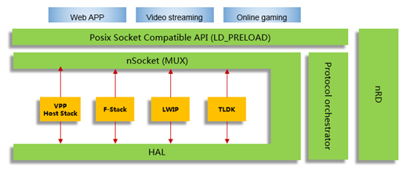
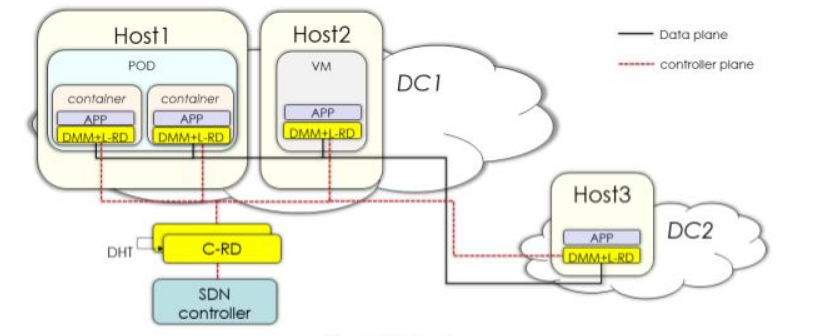
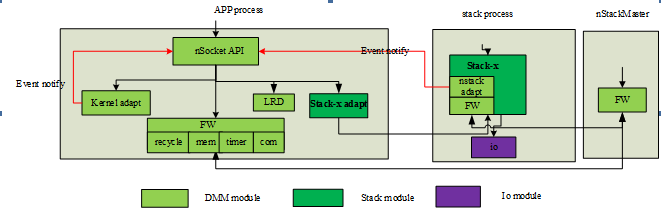
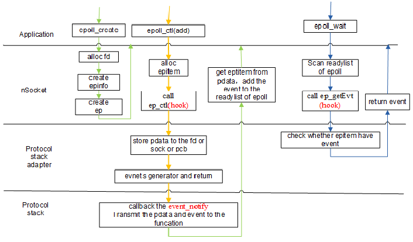
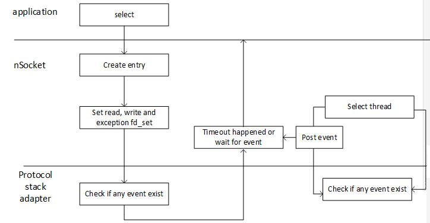
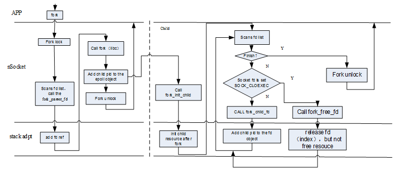

#**DMM Developer Manual**

[**1. Introduction**](#1.-introduction)<br>
[**2. DMM Overall Architecture**](#2.-dmm-overall-architecture)<br>
[**3. Core Components**](#3.-Core-Components)<br>
[**3.1 nSocket**](#3.1-nsocket)<br>
[**3.2 Framework**](#3.2-framework)<br>
[**3.3 Adapter**](#3.3-adapter)<br>
[**3.4 nRD**](#3.4-nrd)<br>
[**3.5 HAL**](#3.5-hal)<br>
[**4 DMM Plug-in Architectures**](#4-dmm-plug-in-architectures)<br>
[**4.1 Overview**](#4.1-overview)<br>
[**4.2 Plug-in interface**](#4.2-plug-in-interface)<br>
[**4.2.1 Interface of Stackx adapter APIs**](#4.2.1-interface-of-stackx-adapter-apis)<br>
[**4.2.1.1 nstack\_stack\_register\_fn**](#4.2.1.1-nstack\_stack\_register\_fn)<br>
[**4.2.2 Interface of DMM-adapter APIs**](#4.2.2-interface-of-dmm-adapter-apis)<br>
[**4.2.2.1 nstack\_adpt\_init**](#4.2.2.1-nstack\_adpt\_init)<br>
[**4.2.5 Multithreading**](#4.2.5-multithreading)<br>
[**4.2.6 Resource recovery**](#**4.2.6-resource-recovery)<br>
[**4.2.6.1 obj\_recycle\_reg**](#4.2.6.1-obj\_recycle\_reg)<br>
[**4.2.6.2 obj\_recycle\_fun**](#4.2.6.2-obj\_recycle\_fun)<br>
[**4.2.7 nRD**](#4.2.7-nrd)<br>
[**5 Release file**](#5-release-file)<br>
[**5.1 libs**](#5.1-libs)<br>
[**5.2 Posix API of nSocket**](#5.2-posix-api-of-nsocket)<br>
[**6 Log & Debug**](#6-log-debug)<br>
[**7 How to use the incidental apps to test the protocol stack**](#7-how-to-use-the-incidental-apps-to-test-the-protocol-stack)<br>
[**7.1 App introduction**](#7.1-app-introduction)<br>
[**7.2 Test implementation**](#7.2-Test-implementation)<br>

**1. Introduction**<br>
============================

This document is used to guide the user-mode protocol stack developers to use
the DMM(Dual mode Multi protocol Multi instance) framework. The document defines the
interface that need to be registered to the DMM when the protocol stack is integrated into the
DMM and the interface that the DMM provides to the protocol stack. In the document as well
as in the code, DMM is also referred as nStack(NeuroStack). The two names are interchangeable.

**2. DMM Overall Architecture**<br>
============================



Figure1. DMM bird's eye view.

The DMM framework provides posix socket APIs to the application. A protocol stack could be
plugged into the DMM. DMM will choose the most suitable stack according to the policy
of nRD to application. nRD(Neuro Resource Discovery) is a control sub system  which is used
to choose a protocol stack for application based on certain rules, such
as  network information,
SLA, security and so on. The mapping between apps (connections/sockets) and candidate
networking stack instances is now use static configurations.

**3. Core Components**<br>
============================

Figure1 shows an overview of the architecture design for DMM. DMM can be divided into
five main components:  nSocket, Framework (FW), adapters, nRD, and HAL.

**3.1 nSocket**
-----------

“nSocket” provides user-friendly POSIX Compatible API of nStack, it intercepts the socket
API calls from the user application via system call hijacking or the LD_PRELOAD mechanism.

**3.2 Framework**
-------------

Framework is a public framework module that includes shared-memory management, IPC-management,
initialization framework, basic data structures and timer.

**3.3 Adapter**
-----------

**nStack-adapter:** Used by protocol stack and implemented by DMM. Provides interfaces towards DMM.

**Stack-x-adapter:** Used by DMM and implemented by protocol stack. Provides interfaces
towards protocol stack.

**Kernel-adapter:** Used and implemented by DMM. Help interact with kernel stack.

**3.4 nRD**
-------


nStack provides dynamic mapping between apps (connections/sockets) and candidate
networking stack instances. And this flexibility is achieved by the nRD.

**3.5 HAL**
-------

HAL (Hardware Abstraction Layer) layer provides the following functions for upper-layer
protocol stack:
- A unified user plane IO interface, shields the lower-level driver implementation differences.
- Mask the port implementation differences between IO layer and Protocol stack. Initialize
the network interface card.


**4 DMM Plug-in Architectures**<br>
=========================

**4.1 Overview**
------------

DMM-Plug-in architecture is an attractive solution for developers seeking to build protocol
stacks that are multi-functional, app independent, and easily extensible.


Figure3. The Integration scheme

Figure 3 shows a typical deployment mode that protocol stack and application process are
deployed in a pipeline mode across processes. IPC is used for communication between them.

+ DMM need to integrate the protocol stack adapter-library (Figure 3: stack-x adapter). The library
should be developed by protocol stack, and the library implements the interfaces defined in
the list1. The protocol stack adapter is used for communicating with protocol stack process.
In addition to the function of the protocol stack, this module must implement the interfaces
defined by DMM, including the socket APIs, epoll APIs, fork APIs and the resource recycle APIs.

|  Interface | detail |
| --------- | ------ |
|    ep\_ctl        |   Section 4.2.2.1 |
|    ep\_getevt     |   Section 4.2.2.2 |
| fork\_init\_child |   Section 4.2.4.1 |
| fork\_parent\_fd  |   Section 4.2.4.2 |
| fork\_child\_fd   |   Section 4.2.4.3 |
| fork\_free\_fd    |   Section 4.2.4.4 |
| module\_init      |  Section 4.3.5.5 |

List1. The function provided by protocol adapter.

+ Protocol stack needs to integrate the DMM adapter-library(Figure 3: nstack adapter). This library
will be developed by DMM. It creates and initializes shared-memory. The shared-memory
is used as IPC to achieve high performance communication between nStack and protocol stack.
The library utilizes the plug-in interface to provide rich features to the protocol stack, such as
resource recycle and event management.

+ Protocol stack needs to call the nstack\_adpt\_init (See section 4.2.1.6 for details) defined
in the DMM adapter library to create and initialize the shared memory object used for IPC.
DMM adapter library also provide functions to recycle shared memory objects (See section 4.2.6.2
for details) to the protocol stack. When protocol stack receive the app  exit signal, DMM adapter
handle the exit signal, and trigger shared resource recovery action. Protocol stack does not
need to focus on the exit of the application.

+ In the dual process mode, protocol stack process creates shared memory and initialize
it with the help of DMM adapter library where as application
 process looks up and
 attaches to the shared memory .

+  nRD module reads the routing information from the configuration file to create a  mapping
system which used to make a decision as nSocket selects the protocol stack.

With these modules, DMM provides a unified socket interface, and support epoll, select,
fork, zero copy, resource recovery features.

**4.2 Plug-in interface**
---------------------

###**4.2.1 Interface of Stackx adapter APIs**

The following adapter APIs must be implemented by the protocol stack as part of stackx adapter.
Hook functions which will be initialize in this function will be used later to communicate with
stackx later.

**4.2.1.1 nstack\_stack\_register\_fn**

Function prototype:

```
typedef int (*nstack_stack_registe_fn) (nstack_proc_cb *proc_fun, nstack_event_cb *event_ops);

```
There are two parameters in this function.

nstack\_proc\_cb: Has two parts, socket operations, which is defined in declare\_syscalls.h.tmpl
file and is same is in Posix, and nstack\_extern\_ops, are some other functionality like module
initialization etc.
```
typedef struct __nstack_proc_cb
{
  nstack_socket_ops socket_ops; /*posix socket api */
  nstack_extern_ops extern_ops; /*other proc callback */
} nstack_proc_cb;

typedef struct __nstack_extern_ops
{
  int (*module_init) (void);    /*stack module init */
  int (*fork_init_child) (pid_t p, pid_t c);    /*after fork, stack child process init again if needed. */
  void (*fork_parent_fd) (int s, pid_t p);      /*after fork, stack parent process proc again if needed. */
  void (*fork_child_fd) (int s, pid_t p, pid_t c);      /*after fork, child record pid for recycle if needed. */
  void (*fork_free_fd) (int s, pid_t p, pid_t c);       /*for SOCK_CLOEXEC when fork if needed. */
  unsigned int (*ep_ctl) (int epFD, int proFD, int ctl_ops, struct epoll_event * event, void *pdata);   /*when fd add to epoll fd, triggle stack to proc if need */
  unsigned int (*ep_getevt) (int epFD, int profd, unsigned int events); /*check whether some events exist really */
  int (*ep_prewait_proc) (int epfd);
  int (*stack_fd_check) (int s, int flag);      /*check whether fd belong to stack, if belong, return 1, else return 0 */
  int (*stack_alloc_fd) ();     /*alloc a fd id for epoll */
  int (*peak) (int s);          /*used for stack-x , isource maybe no need */
} nstack_extern_ops;


/*
 *Standard api interface definition.
 *these interface is provided by Protocol stack to nStack
 */
typedef struct __nstack_socket_ops
{
#undef NSTACK_MK_DECL
#define NSTACK_MK_DECL(ret, fn, args)  ret (*pf##fn) args
#include "declare_syscalls.h"
} nstack_socket_ops;

```
nstack\_event\_cb:

```
typedef struct __nstack_event_cb
{
  void *handle;                 /* current so file handler */
  int type;                         /* nstack is assigned to the protocol stack and needs to be passed to nstack when the event is reported */
  int (*event_cb) (void *pdata, int events);
} nstack_event_cb;

```

When the protocol stack(a.k.a stackx) is integrated into DMM, there are some changes required
to be done in DMM. These are as follows:

The first step is adding new protocol stack module information into DMM. This information can be
registed to DMM and **g\_nstack\_module\_desc** will store these configuration information,
e.g. registration function name, lib path, etc.


```
nstack_module_keys  g_nstack_module_desc[] ={};

typedef struct _ nstack_module_keys {
    const ns_char*  modName;          /*stack name*/
    const ns_char*  registe_fn_name;  /*stack register func name*/
    const ns_char*  libPath;          /*if libtype is dynamic,  it is the path of lib*/
    ns_char         deploytype;       /*depoly model type:  model type1,  model type2,  model type3*/
    ns_char         libtype;          /*dynamic lib or static lib*/
    ns_char         ep_free_ref;      /*when epoll information free,  need to wait that stack would not
                                    notify event */
    ns_char         default_stack;    /*whether is default stack: when don't know how to choose stack,
                                    just use default stack firstly*/
    ns_int32        priority;         /*reserv*/
    ns_int32        maxfdid;          /* the max fd id,  just used to check*/
    ns_int32        minfdid;          /* the min fd id,  just used to check */
    ns_int32        modInx;           /* This is alloced by nStack ,  not from configuration */
} nstack_module_keys;


typedef enum {
    NSTACK_MODEL_TYPE1,   /*nSocket and stack belong to the same process*/
    NSTACK_MODEL_TYPE2,   /*nSocket and stack belong to different processes,
                           *and nStack don't take care the communication between stack and stack adpt*/
    NSTACK_MODEL_TYPE3,   /*nSocket and stack belong to different processes,  and stax-x-adapter was
                        spplied to communicate whit stack*/
    NSTACK_MODEL_INVALID,
} nstack_model_deploy_type;

```
Some important fields are:

**ep\_free\_ref :**
This field in data structure nstack\_module\_keys is used in pipe-line mode. When the application
process exits, the socket resources in the application process are released, but the
resources in the protocol stack are not released. At this time, the protocol stack needs
to continue accessing the epoll shared resource to send events.  So, you cannot free the resources
of epoll immediately after the application exits. Only when the resources of the
protocol stack are completely released, the epoll share resource can be released and it is
done by the interface provided by the DMM adapter. This field marks whether the stack
needs to release the epoll resources. If it is 1, DMM will not release resources when close
is called, and the stack must calls the interface provided by DMM adapter to release
after releasing its own resources. If it is 0, DMM(nSocket) released the source directly.

**modInx :**
Then module index unique number to identify the module.

**maxfdid and minfdid:**
Maximum and minimum FD supported.

**libpath :**
lib name with path provided by stack.

**deploytype :**
Indicating single or multi process deployment. Used during shared memory initialization.

**libtype :**
Indicates dynamic or static library.

**default_stack :**
During decision making of which stack to use if no stack is available default stack will be used.

**registe_fn_name :**
This is actual function name for nstack\_stack\_register\_fn and will be called by nstack,
during protocol stack initialization.

After calling the nstack\_stack\_registe_fn() (See section 4.2.1.1 for details) , the information
initialized(e.g. hook function etc.) by the protocol stack adapter (stackx) will be stored in
nstack\_module\_info along with other corresponding key stack information.

```
nstack_module_info g_nstack_modules;

typedef struct{
    ns_int32 modNum;        // Number of modules registered
    ns_int32 linuxmid;
    ns_int32 spmid;         /* Stackx module index. */
    nstack_module *defMod;  // The default module
    nstack_module modules[NSTACK_MAX_MODULE_NUM];
} nstack_module_info;


typedef struct __NSTACK_MODULE {
    char modulename[NSTACK_PLUGIN_NAME_LEN];
    ns_int32  priority;
    void* handle;
    nstack_proc_cb  mops;
    ns_int32        ep_free_ref;  //ep information need free with ref
    ns_int32        modInx;       // The index of module
    ns_int32        maxfdid;      //the max fd id
    ns_int32        minfdid;      //the min fd id
} nstack_module;

```

So far we discussed about stackx adapter and what change we need in DMM to integrate
stackx with DMM. Now one thing is worth mentioning here, that how nstack implemented epoll
mechanism, so that it will be easy to support epoll feature by protocol stack(stackx).

###**epoll Architecture**
When the application calls epoll\_create() or socket(), nstack first creates epoll info
object of the data type of nsep\_epollInfo\_t. This structure stored the FD information of socket
fd or epoll fd. fdtype denotes if this structure referring to an epoll or a socket.

```
typedef struct{
    int iindex;
    int iNext;
    int fd;
    i32 fdtype;     /* 0:  socket fd,  1:  epoll fd */
    i32 rlfd;       /* copy of fdInf->rlfd */
    i32 rmidx;      /* copy of fdInf->rmidx */
    i32 protoFD[NSEP_SMOD_MAX];
    i32 epaddflag[NSEP_SMOD_MAX];
    struct eventpoll *ep;
    sys_sem_st epiLock;
    sys_sem_st freeLock;
    struct ep_list epiList;    /* This restore the epitem of this file descriptor */
    u32 sleepTime;   /* add for NSTACK_SEM_SLEEP */
    nsep_pidinfo pidinfo;
    nsfw_res res_chk;
    void* private_data;
    i32 reserv[4];
} nsep_epollInfo_t;

```

For epoll then it creates an eventpoll (struct eventpoll) object.

```
struct eventpoll {
    sys_sem_st lock;        /*eventpoll lock*/
    sys_sem_st sem;         /* rdlist lock */
    sem_t waitSem;          /*sem for epoll_wait */
    struct ep_hlist rdlist; /*ready epitem list*/
    struct ep_hlist txlist; /*pad*/
    struct ep_rb_root rbr;  /* rbtree*/
    int epfd;               /*epoll  fd*/
    u32 pid;                /* Pid of the process who creat the structure,  the resources used to release */
    nsfw_res res_chk;       /* Verify whether resources are repeatedly released */
};
```

For the created nsep\_epollInfo\_t object, when the file descriptor is an epoll socket,
ep(nsep_epollInfo_t) points to eventpoll. When the application calls epoll\_ctl() to add a
socket to the epoll, nSocket allocates an epitem object. The fd is socket fd which need to add
to epoll object.

```
struct epitem {
    struct ep_rb_node rbn;
    struct ep_hlist_node rdllink;
    struct ep_hlist_node lkFDllink;
    int nwait;
    struct eventpoll *ep;
    nsep_epollInfo_t *epInfo;
    struct epoll_event event;
    struct list_node fllink;
    struct ep_hlist_node txlink;
    unsigned int revents;
    int fd;
    u32 pid;
    void* private_data;
    nsfw_res res_chk;
};

```
The epitem object is added to two places, rbr (a redblack tree of struct eventpoll) and
also epList (nsep\_epollInfo\_t), which is created during epoll_create(basically this is
of fdtype epoll) in the previous step. In the epitem object just allocated, nstack uses ep to
point back to eventpoll, revents to store event that is produced by the protocol stack, epinfo
to point to the epoll object in the data type of nsep\_epollInfo\_t. This is how DMM connects
the epoll, event, and socket together.

When the application calls epoll\_wait(), nSocket scans the rdlist in eventpoll to get
events and return them to the application.

Figure 3 is Runtime Graphs of nSocket in epoll function:



Figure 4: flow chart of various epoll functions function:


Below are the details of hook functions provided by protocol stack.

###**ep\_ctl**
```
unsigned int (*ep_ctl) (int epFD, int proFD, int ctl_ops, struct epoll_event * event, void *pdata);
```

**Description:**
1\. Called by the nstack to inform protocol stack to add/modify/delete file descriptor (FD)
to/from epoll and monitor events.
2\. When the application adds new events or modifies existing events, it gets prompt notification.
3\. pdata stores the nsep_epollInfo_t corresponding to the FD. It is used to pass the
value to the protocol stack event notification API when an event occurs.

**Parameters:**

*proFD*: sock file descriptor created by the protocol stack.
*ctl\_ops*: 0 add, 1 modify, 2 delete.
*event*: similar to Linux “struct epoll\_event”.
*pdata*: Private data (nsep_epollInfo_t ) that nstack passes to the protocol stack.

**Interface implemented by:** Protocol stack.

###**ep\_getevt**

**Interface Definition:**

```
unsigned int (*ep_getevt) (int epFD, int profd, unsigned int events);
```

**Description:**

To check if an event in protocol stack exist. Due to multi-threading or other reasons, it’s
possible that protocol stack is busy and causes delay in event notification. Or event
may be cleared by some application operation. Application may use the API to check whether
the event still exists.

**Parameters:**

*epFD*: epoll FD.
*proFD*: sock file descriptor created by the protocol stack.
*event*: Events which need to check.

**Interface implemented by:** Protocol stack.

Similar to epoll, select functionality is also implemented by nstack.
###**select**

Select requires the protocol stack adapter module to provide a select API in order to query
for existing events. When the application calls select(), nStack starts a separate thread to
fetch the select event for each stack and sends it back to the application.



Figure 6: flow chart of select function

**pfselect**

```
int *pfselect(int s, fd_set* readfds, fd_set* writefds, fd_set* exceptfds, struct timeval* timeout)
```

**Description:**

Query whether there is a corresponding protocol stack event.

**Parameters:**

*s*: The maximum file descriptor value in the collection
*readfds*: file descriptor set will be watched for read event
*writefds*: file descriptor set will be watched for write event
*exceptfds*: file descriptor set will be watched for exception cases

**Interface implemented by:** Protocol Stack

nStack also provide fork support. stackx adapter need to implement fork hook functions.
###**fork**

fork() creates a child process by making an exact duplicate of the calling process in a
separate address spaces. Each process, parent and child, has its
own process address
space where memory segments, such as code segment, data segment, stack segment, etc.,
are placed.

There are few exceptions to this.

1\. The fork system call duplicates all the file descriptors of the parent into the child,
so that the file descriptors in the parent and child point to the same files.
2\. The shared memory is still shared between parent and child process after fork ().
3\. Child process clones only thread, which executed it.

When parent process or child process releases the shared resources on process quit or
kill, it affects the other process. Also if the child process wants to inherit other threads
in the parent process, the child process needs to pull or create those threads after the
fork. Both parent and child process can access the shared memory, it create conflicts.
Because of these issues, DMM provides the fork APIs to take care of processing before
and after calling the Linux fork interface. It includes interface lock and shared resource lock,
reference count incrimination, saving the PID of the sub processes, reinitialization
and SOCK\_CLOEXEC option in socket special handlings. Each shared memory data structure
in nstack contains a reference count and a list of process pids, so that the shared memory
can be managed between parent and child processes. On each fork, the reference count is
increased by 1 and the child process id is added to the pid array.

```
typedef struct
{
  u32 pid_used_size;
  u32 pid_array[NSTACK_FORK_NUM];
} nsep_pidinfo;

```

DMM needs assistance from protocol stack to release or hold the shared resources. Protocol
stack is to provide stack specific implementation on these DMM APIs.

The following flow chart shows how fork process is handled:



###**fork\_init\_child**


```
int (* fork_init_child) (pid_t p, pid_t c)
```

**Description:**

After fork, the API is used to add child process pid into the pid list in the share socket data
structure. When the child process exits, only the resources in the child process are released
unless the shared resource reference count reaches 0.

**Parameters:**

*p*: parent process pid

*c*: child process pid


**Interface Implemented by:** Protocol stack.

###**fork\_parent\_fd**

```
void (* fork_parent_fd)(int s, pid_t p)
```

**Description:**

For the socket with the SOCK_CLOEXEC flag on, when it is closed after fork, only the file
descriptor is recycled, no other resource is released. It is a special treatment for SOCK_CLOEXEC.

**Parameters:**

*s*: socket fd

*p*: parent process pid

**Interface Implemented by:** Protocol stack.

###**fork\_child\_fd**

```
void (* fork_child_fd) (int s, pid_t p, pid_t c);
```

**Description:**

After fork, the API is used to add child process pid into the pid list in the share socket data
structure. When the child process exits, only the resources in the child process are released
unless the shared resource reference count reaches 0.

**Parameter Description:**

*s*: file descriptor of the socket to be operated

*p*: parent process pid

*c*: child process pid

**Interface Implemented by:** Protocol stack.

###**fork\_free\_fd**

```
void (* fork_free_fd) (int s, pid_t p, pid_t c);
```

**Description:**

For the socket with the SOCK\_CLOEXEC flag on, when it is closed after fork, only the file
descriptor is recycled, no other resource is released. It is a special treatment for SOCK\_CLOEXEC.

**Parameters:**

*s*: socket fd.

*p*: parent process pid.

*c*: child process pid.

**Interface Implemented by:** Protocol stack

###**4.2.2 Interface of DMM-adapter APIs**

For the multi-process model, DMM provide a library with resource initialization, resource
recycling, event notification and other functions to the
protocol stack.
nstack\_adpt\_init will initialize those functions which can be used by protocol stack(stakx).

**4.2.2.1 nstack\_adpt\_init**

Function prototype:

```
int nstack_adpt_init (nstack_dmm_para * para);

```

```
typedef struct nsfw_com_attr
{
  int policy;
  int pri;
} nsfw_com_attr;

typedef struct __nstack_dmm_para
{
  nstack_model_deploy_type deploy_type;
  int proc_type;
  nsfw_com_attr attr;
  int argc;
  char **argv;
} nstack_dmm_para;

```

Some important fields are:


** deploy\_type : **
Decides whether protocol stack is deployed in same process along with DMM or in a separate process.

** proc_type: **
In multi process environment, the process type will identify the process in framework.
Framework may take different action for resource allocation/initialization based on process type.
```

 typedef enum _fw_poc_type
{
  NSFW_PROC_NULL = 0,
  NSFW_PROC_MAIN,
  NSFW_PROC_APP,
  NSFW_PROC_CTRL,
  NSFW_PROC_TOOLS,
  NSFW_PROC_ALARM,
  NSFW_PROC_MAX = 16
} fw_poc_type;

```
DMM adapter also provides utility function to free shared epoll resource, in case APP process exit.

**nsep\_force\_epinfo\_free**

```
int (*nsep_force_epinfo_free)(void *pdata)
```

**Description:**

When closes fd, the protocol stack frees the resources related to fd. This API is called by
the protocol stack to release private data of type nsep_epollInfo_t.

**Precautions for use:**

This API should only be called when ep\_free\_ref is configured 1 in
nstack\_module\_keys.

**Parameters:**

*pdata*: pdata is the private data in ep\_ctl(), type nsep_epollInfo_t.

**Interface implemented by:** DMM

**nsep\_force\_epitem_free**

```
int (*nsep_force_epitem_free)(void *pdata)
```

**Description:**

When closes fd, the protocol stack frees the resources related to fd. This API is called by the protocol stack to release private data of type struct epitem.

**Precautions for use:**

This API should only be called when ep\_free\_ref is configured 1 in
nstack\_module\_keys.

**Parameters:**

*pdata*: pdata is the private data in ep\_ctl(), type epitem.

**Interface implemented by:** DMM

**nsep\_force\_epevent\_free**

```
int (*nsep_force_epitem_free)(void *pdata)
```

**Description:**

When closes fd, the protocol stack frees the resources related to fd. This API is called by the
protocol stack to release private data of type struct eventpoll.

**Precautions for use:**

This API should only be called when ep\_free\_ref is configured 1 in
nstack\_module\_keys.

**Parameters:**

*pdata*: pdata is the private data in ep\_ctl(), type struct eventpoll.

**Interface implemented by:** DMM


### **4.2.5 Multithreading**

nSocket supports multi-thread. nSocket uses a ref and state to support the feature.

### **4.2.6 Resource recovery**

Protocol stack must implement resource recovery. When the application crashes or exits,
the resources allocated by protocol stack must be released, otherwise it causes resource leaking
and can crash the system. DMM provides the following mechanism to support the feature.
There is certain relationship between resource recovery and fork. Each fork increases
the reference count by 1 and saves the child process PID to the corresponding shared resource.
On exiting of the process, decreases the reference count by 1 if the exiting process PID
equals to one of the saved PIDs and releases the shared resource if the reference count is 0,
do not release the shared resource if the reference count in not zero.

1. There are two kinds of resource recovery, normal exit and abnormal process exit. Resources
are freed on normal exit operation. But on the abnormal process exits, there is no one to
clean up the shared resources   or decrease the reference count, so we rely on the separate
process to monitor the processes and notify the stack process to release the resources.

2. To support resource recovery, the protocol stack needs to define a resource  object type
in responding to DMM request and registers the recycle function at initialization time.

**4.2.6.1 nsfw\_recycle\_reg\_obj**
During initilization of stackx process, when calling nstack\_adpt\_init
nsfw\_recycle\_reg\_obj will be called to register the object type that need to be recycled if the APP process exit.

```
typedef enum _nsfw_recycle_item_type
{
  NSFW_REC_TYPE_NULL = 0,
  ...
  NSFW_REC_NSOCKET_START,
  NSFW_REC_NSOCKET_EPOLL,
  NSFW_REC_NSOCKET_END = NSFW_REC_NSOCKET_START + 63,
  NSFW_REC_TYPE_MAX = 512
} nsfw_recycle_item_type;

```
For each item type a register function need to provide.
**4.2.6.2 nsfw\_recycle\_reg_fun**
Register recycle function for a record type.

```
u8 nsfw_recycle_reg_fun (u16 rec_type, nsfw_recycle_fun fun);

typedef nsfw_rcc_stat (*nsfw_recycle_fun) (u32 exit_pid, void *pdata,
                                           u16 rec_type);
```
This function will be called when APP process exit notification will be send to StackX process.
###**4.2.7 nRD**

LRD function is mainly the protocol stack routing function, the internal storage of a protocol
stack selection policy table. When multiple protocol stacks are integrated, according
to the incoming IP address, protocol stack type and other information, you can select a suitable
protocol stack from the protocol Stack selection policy table. During nSocket module
initialization, it invokes the LRD module initialization API to register the protocol stack information
and the protocol stack selection policy gets the interface. The initialization function
for the LRD module is defined as follows.

```
int nstack_rd_init (nstack_stack_info *pstack, int num, nstack_get_route_data *pfun, int fun_num)

typedef struct __nstack_rd_stack_info
{
    /*stack name */
    rd_stack_plane_map stack;
    /*stack id */
    int stack_id;
    /*when route info not found, high priority stack was chose, same priority chose fist input one */
    int priority;                 /*0: highest: route info not found choose first */
} nstack_rd_stack_info;

/*rd local data*/
typedef struct __rd_local_data {
    nstack_rd_stack_info *pstack_info;
    int stack_num;
    nstack_rd_list route_list[RD_DATA_TYPE_MAX];  /*route table */
    nstack_get_route_data sys_fun[NSTACK_SYS_FUN_MAX];    /*rd data sys proc function list */
    int fun_num;
} rd_local_data;

rd_local_data *g_rd_local_data = NULL;

/*get rd info. if return ok, data callee alloc memory, caller free, else caller don't free*/
int (*nstack_get_route_data)(rd_route_data **data, int *num);

```

When a new protocol stack is integrated into DMM, the protocol stack selection configuration
file will not directly match with the protocol stack name, but
with the plane name,
which is more descriptive about stack and other interface
technology, therefore
the RD has a map between the protocols stack and plane name.

```
typedef struct __rd_stack_plane_map{
    char stackname[STACK_NAME_MAX];   /* Stack name */
    char planename[RD_PLANE_NAMELEN];   /* Plane name */
    int stackid;       /*stack id */
} rd_stack_plane_map;

rd_stack_plane_map g_nstack_plane_info[] = {
   {{“stackx”},  {“nstack-dpdk”} , -1},
   {{“kernel”},  {“nstack-linux”} , -1},
};

```
When application calls the DMM socket, connect, sendto, sendmsg APIS, it triggers the nSocket
module to invoke the nstack\_rd\_get\_stackid() API to get the route information. The protocol
stack is then selected based on the returned protocol stack ID.

**nstack\_rd\_init**

```
int nstack_rd_init (nstack_stack_info * pstack, int num, nstack_get_route_data *pfun, int fun_num)
```

**Description:**

This function Initializes the RD module. When initialized, nStack passes all the integrated protocol
stacks information to the RD module. The information includes the protocol stack name, stack id etc.
The stack informations stored in g\_rd\_local\_data.

**Parameters:**

*pStack*: a list of the protocol stack info
*num*: the number of protocol stack info passed in.
*pfun*: function to get the protocol stack selection information.
*fun_num*: the number of pfun passed in

**Interface implemented by:** DMM

**nstack\_get\_route\_data**

```
typedef int (*nstack_get_route_data) (rd_route_data ** data, int *num);
```

**Description:**

Obtain the protocol stack selection information according to the protocol stack plane name.

**Parameters:**

*planename*: description on stack and other interface technology. nSocket provides
the protocol stack name. The configuration file saves an outbound interface type, which
is corresponding to a protocol stack.
*data*: protocol stack selection information.

```
typedef enum __rd_data_type{
   RD_DATA_TYPE_IP,       / * According to the ip address to select the protocol stack * /
   RD_DATA_TYPE_PROTO,    / * Select protocol stack by protocol type * /
   RD_DATA_TYPE_MAX,
}rd_data_type;

typedef struct __rd_route_data{
    rd_data_type type; / * Stored protocol stack selection type * /
    char stack_name[RD_PLANE_NAMELEN];    / * Stack plane name */
    union {
       rd_ip_data ipdata;        / * Select the IP address of the protocol stack type * /
       unsigned int proto_type;  / * Select protocol information for this stack * /
    };
} rd_route_data;

```

*num*: The number of routing information returned.

**Interface implemented by:**DMM

**nstack\_rd\_get\_stackid**

```
int nstack_rd_get_stackid(nstack_rd_key* pkey, int *stackid) ;
```

**Description:**

Select parameters according to the protocol stack to obtain the protocol stack id corresponding to
the parameter.

**Parameter:**

*pkey*: protocol stack selection key.

```
typedef struct __nstack_rd_key{
    rd_data_type type;       / * Select protocol type parameters * /
    union {
        unsigned int ip_addr;  / * This field is valid if the type is RD_DATA_TYPE_IP, which is
                                   the IP address of the connection to be initiated * /
        unsigned int proto_type; / * This field is valid if the type is RD_DATA_TYPE_PROTO, which
                                   is the protocol type of the socket created at the time * /
    };
} nstack_rd_key;

```

*stackid*: output parameter; nStack internal number of the protocol stack id.

**Interface implemented by:** DMM

**5 Release file**<br>
================

**5.1 libs**
-------------------------
**libnStackAPI.so:** The API library that DMM provides to the application. <br>
**libnStackAdapt.so:** The adapter library that DMM provides to the stack developer
connects the DMM and the protocal stack implementation.

**5.2 Posix API of nSocket**
-------------------------
DMM provides socket APIs and integrates various protocol stacks. DMM selects and invokes
a specific protocol stack based on the information, such as IP and protocol type, from the
application. The protocol stacks do not interact with the application. After the selection,
what features an API supports are determined by the implementation provided by the protocol
stack itself. The standard socket APIs defined by DMM are as follows:

  Interface definition                                                      |            Interface Description
  --------------------                                                      |            ---------------------
  int socket(int, int, int)                                                     |            same as corresponding POSIX apis
  int bind(int, const struct sockaddr\*, socklen\_t)                            |            same as corresponding POSIX apis
  int listen(int, int)                                                          |            same as corresponding POSIX apis
  int shutdown(int, int)                                                        |            same as corresponding POSIX apis
  int getsockname(int, struct sockaddr\*, socklen\_t\*)                         |            same as corresponding POSIX apis
  int getpeername(int, struct sockaddr\*, socklen\_t\*)                         |            same as corresponding POSIX apis
  int getsockopt(int, int, int, void\*, socklen\_t\*)                           |            same as corresponding POSIX apis
  int setsockopt(int, int, int, const void\*, socklen\_t)                       |            same as corresponding POSIX apis
  int accept(int, struct sockaddr\*, socklen\_t\*)                              |            same as corresponding POSIX apis
  int accept4(int, struct sockaddr\*, socklen\_t\*, int flags)                  |            same as corresponding POSIX apis
  int connect(int, const struct sockaddr\*, socklen\_t)                         |            same as corresponding POSIX apis
  ssize\_t recv(int , void\*, size\_t, int)                                     |            same as corresponding POSIX apis
  ssize\_t send(int, const void\*, size\_t, int)                                |            same as corresponding POSIX apis
  ssize\_t read(int, void\*, size\_t)                                           |            same as corresponding POSIX apis
  ssize\_t write(int, const void\*, size\_t)                                    |            same as corresponding POSIX apis
  ssize\_t writev(int, const struct iovec \*, int)                              |            same as corresponding POSIX apis
  ssize\_t readv(int, const struct iovec \*, int)                               |            same as corresponding POSIX apis
  ssize\_t sendto(int, const void \*, size\_t, int, const struct sockaddr \*, socklen\_t) |  same as corresponding POSIX apis
  ssize\_t recvfrom(int, void \*, size\_t, int, struct sockaddr \*, socklen\_t \*)  |        same as corresponding POSIX apis
  ssize\_t sendmsg(int, const struct msghdr \*, int flags)                          |        same as corresponding POSIX apis
  ssize\_t recvmsg(int, struct msghdr \*, int flags)                                |        same as corresponding POSIX apis
  int close(int)                                                                    |        same as corresponding POSIX apis
  int select(int, fd\_set\*, fd\_set\*, fd\_set\*, struct timeval\*)                |        same as corresponding POSIX apis
  int ioctl(int, unsigned long, unsigned long)                                      |        same as corresponding POSIX apis
  int fcntl(int, int, unsigned long)                                                |        same as corresponding POSIX apis
  int epoll\_create(int)                                                            |        same as corresponding POSIX apis
  int epoll\_ctl(int, int, int, struct epoll\_event \*)                             |        same as corresponding POSIX apis
  int epoll\_wait(int, struct epoll\_event \*, int, int)                            |        same as corresponding POSIX apis
  pid\_t fork(void)                                                                 |        Before/after calling base fork() need to handle other processing like ref\_count etc.

  **6. Log & Debug**<br>
============================
nStack uses GLOG framework to provide multi level logs. Supported log levels are debug, info,
warning, error and emergency. Logs will be stored at /var/log/nStack/. To enable log,
need to set the environment variables NSTACK\_LOG\_ON
```
export NSTACK_LOG_ON=DBG
```
Log configuration will be stored in g\_nstack\_logs.
```
struct nstack_logs
{
  uint32_t level;    /**< Log level. */
  int pad64;
  int inited;
  int file_type;
};

struct nstack_logs g_nstack_logs[MAX_LOG_MODULE] = { {0, 0, 0, 0}, {0xFFFF, 0, 0, 0} }; /* Clear compile warning */

Module types:
typedef enum _LOG_MODULE
{
  NSOCKET = 1,
  STACKX,
  OPERATION,
  ...
  LOGHAL,
  ...
  LOGFW,
  MAX_LOG_MODULE
} LOG_MODULE;

/* Log levels*/
#define NSLOG_DBG     0x10
#define NSLOG_INF     0x08
#define NSLOG_WAR     0x04
#define NSLOG_ERR     0x02
#define NSLOG_EMG     0x01
#define NSLOG_OFF     0x00

```
App logs stored in app_$pname_$pid.log. Stackx logs will be stored in running.log. Other operational
logs will be stored in operation.log. App logs will be stored in file if following is set to 1.
```
export NSTACK_LOG_FILE_FLAG=1

```
Also we can memntioned the file name for App log.
```
export NSTACK_APP_LOG_PATH=/path_to_log
```
**7. How to use the incidental apps to test the protocol stack**<br>
============================

**7.1 App introduction**
-------------------------

After building the DMM, test apps will be generated like below.The following table is the
introduction of the client and server apps.


| App name  | client  | server  | use DMM  |send/recv   | s/r + epoll  |  s/r + select |
| ------------ | ------------ | ------------ | ------------ | ------------ | ------------ | ------------ |
| vc_common   |Y   | N  |Y   | send  | N  | N  |
| kc_common  |Y   | N  |  N | send  |N   | N  |
| vs_common  |N   | Y  | Y  |recv   |N   | N  |
| ks_common  |N   |  Y | N  |recv   | N  | N  |
| vs_epoll  |N   | Y  |  Y | recv  | Y  | N  |
| ks_epoll  |  N | Y  |  N | recv  | Y  | N  |
| vs_select  | N  | Y  | Y  | recv  |N   | Y  |
| ks_select  | N  | Y  | N  | recv  |N   | Y  |
Here, the app's name whose first letter is k means that it will run through the kernel.
If the first letter is 'v', it will run through the dmm stack. If the second letter in the
app's name is 's', which means it is the server app. If the second letter is 'c', it means it
is the client app. The 'common' means that the app only implements the function of send or
receive,no select or epoll. The 'select' means the app uses the select() function to
implement the listening service.The 'epoll' means the app uses the epoll() function to
implement the listening service.

**7.2 Test implementation**
-------------------------
Before testing, we need two servers, one for the client and one for the server.Then run the
following codes. The following takes ks_common and vc_common as examples.
**server**

  ```
./ks_common -p 20000 -d <server ip> -a 10000 -s <client ip> -l 200 -t 5000000 -i 0 -f 1 -r 20000 -n 1 -w 10 -u 10000 -e 10 -x 1
  ```

**client**

  ```
./vc_common -p 20000 -d <client ip> -a 10000 -s <server ip> -l 200 -t 5000000 -i 0 -f 1 -r 20000 -n 1 -w 10 -u 10000 -e 10 -x 1
```

The following table is an introduction to some parameters in the code.

 parameter name   |  Functional description
  ------------------- |  ---------------------
  -p                         |           destination port number
  -d                         |            dest severIP
  -a                         |            src portid
  -s                         |            src clientIP
  -l                         |           msg length
  -t                         |            max test time
  -i                          |           msg interval
  -f                         |           client fd number
  -r                         |           receive port
  -n                        |            connect number(one server vs n client)
  -w                       |            wait time
  -u                        |            unit print
  -e                        |            sleep cut
  -x                        |            flag print


