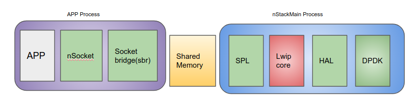

# 1. What is lwIP
lwIP is a light-weight implementation of the TCP/IP protocol suite.
lwIP is freely available (under a BSD-style license) in C source
code format and can be downloaded from the development homepage.
The focus of the lwIP TCP/IP implementation is to reduce the RAM
usage while still having a full scale TCP.

# 2. How to use lwIP

## How to integrate lwIP into DMM
The file CMakeList.txt defined the compiling process, including downloading
the lwip 2.7.0 code and pushing the helper files into it, or modify
lwip files.

Currently lwip will not be build as separate lib, instead it'll be part
of the excutable namely "nStackMain".
lwip Stack will run in pipeline mode. Application will run in one process
and lwip will run as "nStackMain" process. Below picture depicts
a birds eye view of lwip in DMM pipeline mode.


## Compile
```sh
    #cd dmm/build && cmake ..
    #make
    #cd ../stacks/lwip_stack/build && cmake ..
    #make
```

## Test
- Steps 1: update some environment variables
```sh
	#export LD_LIBRARY_PATH=${dmm}/stacks/lwip_stack/release/lib64/
	#export LD_PRELOAD=${dmm}/release/lib64/libnStackAPI.so
	#export NSTACK_MOD_CFG_FILE=${dmm}/stacks/lwip_stack/app_conf/module_config.json
	#export NSTACK_MOD_CFG_RD=${dmm}/stacks/lwip_stack/app_conf/rd_config.json
	#export NSTACK_LOG_ON=DBG  (optional enable debug)
```
- Steps 2: Modify rd_config.json(located at dmm/stacks/lwip_stack/app_config/)
```sh
	#vim rd_config.json
	  Eg. set "subnet": "192.168.21.1/24"
```
Note:
  Means dmm chose lwip_stack if subnet matches 192.168.21.*

- Steps 3: 	Run nStackMain(lwip stack))
```sh
	#cp ${dmm}/stacks/lwip_stack/release/configure/ip_data.json  ${dmm}/stacks/lwip_stack/release/bin/
	#cp ${dmm}/stacks/lwip_stack/release/configure/network_data_tonStack.json  ${dmm}/stacks/lwip_stack/release/bin/

```
Modify ip_data.json
```
Change ref_nic => to interface name which you want to use
Change ip_cidr => ip address you want to use.
```
Modify network network_data_tonStack.json
```
Change ref_nic => to interface name which you want to use
Change subnet => Subnet (ip_cidr belongs to this subnet)
Change gateway, range-start, range-end, dst, gw accordingly. This information will be used by DMM to configure network.
```
Run the process:
```
	#cd ${dmm}/stacks/lwip_stack/release
	#./start_nstack.sh
```

- Steps 4: Communication test between machine A(as server) with machine B
		(as client)

##### Run in machine A
```sh
	#./dmm/release/bin/vs_epoll -p 20000 -d 192.168.21.180 -a 10000 -s 192.168.21.181 -l 1000 -t 500000 -i 0 -f 1 -r 20000 -n 1 -w 10 -u 50000 -e 10 -x 1
```
Note:
  Means the current machine would be server, and it's
destination address is 192.168.21.180 (client address),
source address is 192.168.21.181(server address)

##### Run in machine B
```
	#./dmm/release/bin/vc_common -p 20000 -d 192.168.21.181 -a 10000 -s 192.168.21.180 -l 1000 -t 500000 -i 0 -f 1 -r 20000 -n 1 -w 10 -u 50000 -e 10 -x 1
```
Note:
  Means the current machine would be client, and it's
destination address is 192.168.21.181 (server address),
source address is 192.168.21.180(client address)

# 3. Document description

(dmm/stacks/lwip_stack/doc)

## CMakeLists.txt
Control file for Cmake compiling.

## config folder
##### module_config.json
- module_config.json is for configuring dmm protocol stack module.

##### rd_config.json
- rd_config.json is to choose which module is better to go through, if subnet matches, It will go through lwip protocol stack when RD type is nstack-dpdk

## lwip helper files.
lwip helper files is implmentation and modification of some supportive functions to run lwip with dmm.

## lwip_stack/src folder

- Implmetation of nStackMain process which provides the framework to hold lwip stack.

## lwip_stack/lwip_src
- Downloaded opensource lwip 2.7.0. code.

# 4. More Information
https://wiki.fd.io/view/DMM
https://savannah.nongnu.org/projects/lwip/
http://lwip.wikia.com/wiki/LwIP_Wiki
[DMM_DeveloperManual.md](../../doc/DMM_DeveloperManual.md)

